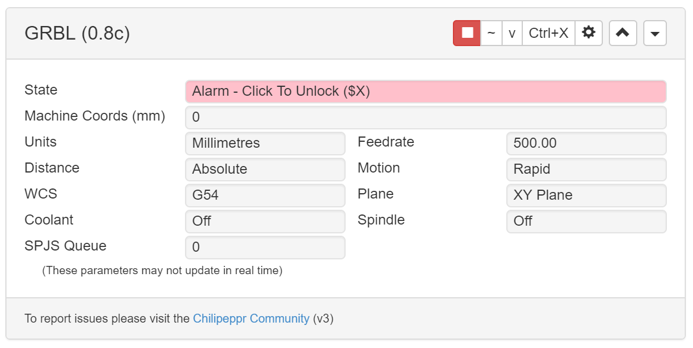

# com-chilipeppr-widget-grbl
This widget shows the GRBL Buffer so other widgets can limit their flow of sending commands and other specific GRBL features.



## ChiliPeppr Widget / GRBL

All ChiliPeppr widgets/elements are defined using cpdefine() which is a method
that mimics require.js. Each defined object must have a unique ID so it does
not conflict with other ChiliPeppr widgets.

| Item                  | Value           |
| -------------         | ------------- | 
| ID                    | com-chilipeppr-widget-grbl |
| Name                  | Widget / GRBL |
| Description           | This widget shows the GRBL Buffer so other widgets can limit their flow of sending commands and other specific GRBL features. |
| chilipeppr.load() URL | http://raw.githubusercontent.com/chilipeppr-grbl/widget-grbl/master/auto-generated-widget.html |
| Edit URL              | http://ide.c9.io/chilipeppr/widget-grbl |
| Github URL            | https://github.com/chilipeppr-grbl/widget-grbl |
| Test URL              | https://preview.c9users.io/chilipeppr/widget-grbl/widget.html |

## Example Code for chilipeppr.load() Statement

You can use the code below as a starting point for instantiating this widget 
inside a workspace or from another widget. The key is that you need to load 
your widget inlined into a div so the DOM can parse your HTML, CSS, and 
Javascript. Then you use cprequire() to find your widget's Javascript and get 
back the instance of it.

```javascript
// Inject new div to contain widget or use an existing div with an ID
$("body").append('<' + 'div id="myDivWidgetGrbl"><' + '/div>');

chilipeppr.load(
  "#myDivWidgetGrbl",
  "http://raw.githubusercontent.com/chilipeppr-grbl/widget-grbl/master/auto-generated-widget.html",
  function() {
    // Callback after widget loaded into #myDivWidgetGrbl
    // Now use require.js to get reference to instantiated widget
    cprequire(
      ["inline:com-chilipeppr-widget-grbl"], // the id you gave your widget
      function(myObjWidgetGrbl) {
        // Callback that is passed reference to the newly loaded widget
        console.log("Widget / GRBL just got loaded.", myObjWidgetGrbl);
        myObjWidgetGrbl.init();
      }
    );
  }
);

```

## Publish

This widget/element publishes the following signals. These signals are owned by this widget/element and are published to all objects inside the ChiliPeppr environment that listen to them via the 
chilipeppr.subscribe(signal, callback) method. 
To better understand how ChiliPeppr's subscribe() method works see amplify.js's documentation at http://amplifyjs.com/api/pubsub/

  <table id="com-chilipeppr-elem-pubsubviewer-pub" class="table table-bordered table-striped">
      <thead>
          <tr>
              <th style="">Signal</th>
              <th style="">Description</th>
          </tr>
      </thead>
      <tbody>
      <tr valign="top"><td>/com-chilipeppr-widget-grbl/com-chilipeppr-interface-cnccontroller/feedhold</td><td>Feedhold (Emergency Stop). This signal is published when user hits the Feedhold button for an emergency stop of the GRBL. Other widgets should see this and stop sending all commands such that even when the plannerresume signal is received when the user clears the queue or cycle starts again, they have to manually start sending code again. So, for example, a Gcode sender widget should place a pause on the sending but allow user to unpause.</td></tr><tr valign="top"><td>/com-chilipeppr-widget-grbl/com-chilipeppr-interface-cnccontroller/plannerpause</td><td>This widget will publish this signal when it determines that the planner buffer is too full on the GRBL and all other elements/widgets need to stop sending data. You will be sent a /plannerresume when this widget determines you can start sending again. The GRBL has a buffer of 28 slots for data. You want to fill it up with around 12 commands to give the planner enough data to work on for optimizing velocities of movement. However, you can't overfill the GRBL or it will go nuts with buffer overflows. This signal helps you fire off your data and not worry about it, but simply pause the sending of the data when you see this signal. This signal does rely on the GRBL being in {qv:2} mode which means it will auto-send us a report on the planner every time it changes. This widget watches for those changes to generate the signal. The default setting is when we hit 12 remaining planner buffer slots we will publish this signal.</td></tr><tr valign="top"><td>/com-chilipeppr-widget-grbl/com-chilipeppr-interface-cnccontroller/plannerresume</td><td>This widget will send this signal when it is ok to send data to the GRBL again. This widget watches the {qr:[val]} status report from the GRBL to determine when the planner buffer has enough room in it to send more data. You may not always get a 1 to 1 /plannerresume for every /plannerpause sent because we will keep sending /plannerpause signals if we're below threshold, but once back above threshold we'll only send you one /plannerresume. The default setting is to send this signal when we get back to 16 available planner buffer slots.</td></tr><tr valign="top"><td>/com-chilipeppr-widget-grbl/com-chilipeppr-interface-cnccontroller/axes</td><td>This widget will normalize the GRBL status report of axis coordinates to send off to other widgets like the XYZ widget. The axes publish payload contains {x:float, y:float, z:float, a:float} If a different CNC controller is implemented, it should normalize the coordinate status reports like this model. The goal of this is to abstract away the specific controller implementation from generic CNC widgets.</td></tr><tr valign="top"><td>/com-chilipeppr-widget-grbl/com-chilipeppr-interface-cnccontroller/units</td><td>This widget will normalize the GRBL units to the interface object of units {units: "mm"} or {units: "inch"}. This signal will be published on load or when this widget detects a change in units so other widgets like the XYZ widget can display the units for the coordinates it is displaying.</td></tr><tr valign="top"><td>/com-chilipeppr-widget-grbl/com-chilipeppr-interface-cnccontroller/proberesponse</td><td>Publish a probe response with the coordinates triggered during probing, or an alarm state if the probe does not contact a surface</td></tr><tr valign="top"><td>/com-chilipeppr-widget-grbl/com-chilipeppr-interface-cnccontroller/status</td><td>Publish a signal each time the GRBL status changes</td></tr>    
      </tbody>
  </table>

## Subscribe

This widget/element subscribes to the following signals. These signals are owned by this widget/element. Other objects inside the ChiliPeppr environment can publish to these signals via the chilipeppr.publish(signal, data) method. 
To better understand how ChiliPeppr's publish() method works see amplify.js's documentation at http://amplifyjs.com/api/pubsub/

  <table id="com-chilipeppr-elem-pubsubviewer-sub" class="table table-bordered table-striped">
      <thead>
          <tr>
              <th style="">Signal</th>
              <th style="">Description</th>
          </tr>
      </thead>
      <tbody>
      <tr valign="top"><td>/com-chilipeppr-widget-grbl/com-chilipeppr-interface-cnccontroller/jogdone</td><td>We subscribe to a jogdone event so that we can fire off an exclamation point (!) to the GRBL to force it to drop all planner buffer items to stop the jog immediately.</td></tr><tr valign="top"><td>/com-chilipeppr-widget-grbl/com-chilipeppr-interface-cnccontroller/recvgcode</td><td>Subscribe to receive gcode from other widgets for processing and passing on to serial port</td></tr>    
      </tbody>
  </table>

## Foreign Publish

This widget/element publishes to the following signals that are owned by other objects. 
To better understand how ChiliPeppr's subscribe() method works see amplify.js's documentation at http://amplifyjs.com/api/pubsub/

  <table id="com-chilipeppr-elem-pubsubviewer-foreignpub" class="table table-bordered table-striped">
      <thead>
          <tr>
              <th style="">Signal</th>
              <th style="">Description</th>
          </tr>
      </thead>
      <tbody>
      <tr valign="top"><td>/com-chilipeppr-widget-grbl/com-chilipeppr-widget-serialport/send</td><td>We send to the serial port certain commands like the initial configuration commands for the GRBL to be in the correct mode and to get initial statuses like planner buffers and XYZ coords. We also send the Emergency Stop and Resume of ! and ~</td></tr>    
      </tbody>
  </table>

## Foreign Subscribe

This widget/element publishes to the following signals that are owned by other objects.
To better understand how ChiliPeppr's publish() method works see amplify.js's documentation at http://amplifyjs.com/api/pubsub/

  <table id="com-chilipeppr-elem-pubsubviewer-foreignsub" class="table table-bordered table-striped">
      <thead>
          <tr>
              <th style="">Signal</th>
              <th style="">Description</th>
          </tr>
      </thead>
      <tbody>
      <tr valign="top"><td>/com-chilipeppr-widget-grbl/com-chilipeppr-widget-serialport/ws/onconnect</td><td>When we see a new connect, query for status.</td></tr><tr valign="top"><td>/com-chilipeppr-widget-grbl/com-chilipeppr-widget-serialport/recvline</td><td>When we get a dataline from serialport, process it and fire off generic CNC controller signals to the /com-chilipeppr-interface-cnccontroller channel.</td></tr><tr valign="top"><td>/com-chilipeppr-widget-grbl/com-chilipeppr-widget-serialport/send</td><td>Subscribe to serial send and override so no other subscriptions receive command.</td></tr>    
      </tbody>
  </table>

## Methods / Properties

The table below shows, in order, the methods and properties inside the widget/element.

  <table id="com-chilipeppr-elem-methodsprops" class="table table-bordered table-striped">
      <thead>
          <tr>
              <th style="">Method / Property</th>
              <th>Type</th>
              <th style="">Description</th>
          </tr>
      </thead>
      <tbody>
      <tr valign="top"><td>id</td><td>string</td><td>"com-chilipeppr-widget-grbl"</td></tr><tr valign="top"><td>implements</td><td>object</td><td></td></tr><tr valign="top"><td>url</td><td>string</td><td>"http://raw.githubusercontent.com/chilipeppr-grbl/widget-grbl/master/auto-generated-widget.html"</td></tr><tr valign="top"><td>fiddleurl</td><td>string</td><td>"http://ide.c9.io/chilipeppr/widget-grbl"</td></tr><tr valign="top"><td>githuburl</td><td>string</td><td>"https://github.com/chilipeppr-grbl/widget-grbl"</td></tr><tr valign="top"><td>testurl</td><td>string</td><td>"http://widget-grbl-chilipeppr.c9users.io/widget.html"</td></tr><tr valign="top"><td>name</td><td>string</td><td>"Widget / GRBL"</td></tr><tr valign="top"><td>desc</td><td>string</td><td>"This widget shows the GRBL Buffer so other widgets can limit their flow of sending commands and other specific GRBL features."</td></tr><tr valign="top"><td>publish</td><td>object</td><td>Please see docs above.</td></tr><tr valign="top"><td>subscribe</td><td>object</td><td>Please see docs above.</td></tr><tr valign="top"><td>foreignPublish</td><td>object</td><td>Please see docs above.</td></tr><tr valign="top"><td>foreignSubscribe</td><td>object</td><td>Please see docs above.</td></tr><tr valign="top"><td>config</td><td>object</td><td></td></tr><tr valign="top"><td>err_log</td><td>object</td><td></td></tr><tr valign="top"><td>buffer_name</td><td>string</td><td></td></tr><tr valign="top"><td>report_mode</td><td>number</td><td></td></tr><tr valign="top"><td>work_mode</td><td>number</td><td></td></tr><tr valign="top"><td>controller_units</td><td>object</td><td></td></tr><tr valign="top"><td>status</td><td>string</td><td>"Offline"</td></tr><tr valign="top"><td>version</td><td>string</td><td></td></tr><tr valign="top"><td>q_count</td><td>number</td><td></td></tr><tr valign="top"><td>alarm</td><td>boolean</td><td></td></tr><tr valign="top"><td>offsets</td><td>object</td><td></td></tr><tr valign="top"><td>last_work</td><td>object</td><td></td></tr><tr valign="top"><td>last_machine</td><td>object</td><td></td></tr><tr valign="top"><td>g_status_reports</td><td>object</td><td></td></tr><tr valign="top"><td>gcode_lookup</td><td>object</td><td></td></tr><tr valign="top"><td>init</td><td>function</td><td>function () </td></tr><tr valign="top"><td>options</td><td>object</td><td></td></tr><tr valign="top"><td>setupUiFromCookie</td><td>function</td><td>function () </td></tr><tr valign="top"><td>saveOptionsCookie</td><td>function</td><td>function () </td></tr><tr valign="top"><td>showBody</td><td>function</td><td>function (evt) </td></tr><tr valign="top"><td>hideBody</td><td>function</td><td>function (evt) </td></tr><tr valign="top"><td>btnSetup</td><td>function</td><td>function () </td></tr><tr valign="top"><td>showConfigModal</td><td>function</td><td>function () </td></tr><tr valign="top"><td>hideConfigModal</td><td>function</td><td>function () </td></tr><tr valign="top"><td>saveConfigModal</td><td>function</td><td>function () </td></tr><tr valign="top"><td>updateWorkUnits</td><td>function</td><td>function (units)</td></tr><tr valign="top"><td>updateReportUnits</td><td>function</td><td>function ()</td></tr><tr valign="top"><td>openController</td><td>function</td><td>function (isWithDelay) </td></tr><tr valign="top"><td>closeController</td><td>function</td><td>function (isWithDelay) </td></tr><tr valign="top"><td>getControllerInfo</td><td>function</td><td>function ()</td></tr><tr valign="top"><td>trackGcodeLines</td><td>function</td><td>function ()</td></tr><tr valign="top"><td>restartStatusInterval</td><td>function</td><td>function ()</td></tr><tr valign="top"><td>grblResponse</td><td>function</td><td>function (recvline) </td></tr><tr valign="top"><td>sendCode</td><td>function</td><td>function (sendline)</td></tr><tr valign="top"><td>clearBuffer</td><td>function</td><td>function ()</td></tr><tr valign="top"><td>publishAxisStatus</td><td>function</td><td>function (axes) </td></tr><tr valign="top"><td>plannerLastEvent</td><td>string</td><td>"resume"</td></tr><tr valign="top"><td>publishPlannerPause</td><td>function</td><td>function () </td></tr><tr valign="top"><td>publishPlannerResume</td><td>function</td><td>function () </td></tr><tr valign="top"><td>toInch</td><td>function</td><td>function (mm)</td></tr><tr valign="top"><td>toMM</td><td>function</td><td>function (inch)</td></tr><tr valign="top"><td>addError</td><td>function</td><td>function (line, msg)</td></tr><tr valign="top"><td>forkSetup</td><td>function</td><td>function () </td></tr><tr valign="top"><td>uiHover</td><td>function</td><td>function ()</td></tr>
      </tbody>
  </table>


## About ChiliPeppr

[ChiliPeppr](http://chilipeppr.com) is a hardware fiddle, meaning it is a 
website that lets you easily
create a workspace to fiddle with your hardware from software. ChiliPeppr provides
a [Serial Port JSON Server](https://github.com/johnlauer/serial-port-json-server) 
that you run locally on your computer, or remotely on another computer, to connect to 
the serial port of your hardware like an Arduino or other microcontroller.

You then create a workspace at ChiliPeppr.com that connects to your hardware 
by starting from scratch or forking somebody else's
workspace that is close to what you are after. Then you write widgets in
Javascript that interact with your hardware by forking the base template 
widget or forking another widget that
is similar to what you are trying to build.

ChiliPeppr is massively capable such that the workspaces for 
[TinyG](http://chilipeppr.com/tinyg) and [Grbl](http://chilipeppr.com/grbl) CNC 
controllers have become full-fledged CNC machine management software used by
tens of thousands.

ChiliPeppr has inspired many people in the hardware/software world to use the
browser and Javascript as the foundation for interacting with hardware. The
Arduino team in Italy caught wind of ChiliPeppr and now
ChiliPeppr's Serial Port JSON Server is the basis for the 
[Arduino's new web IDE](https://create.arduino.cc/). If the Arduino team is excited about building on top
of ChiliPeppr, what
will you build on top of it?

